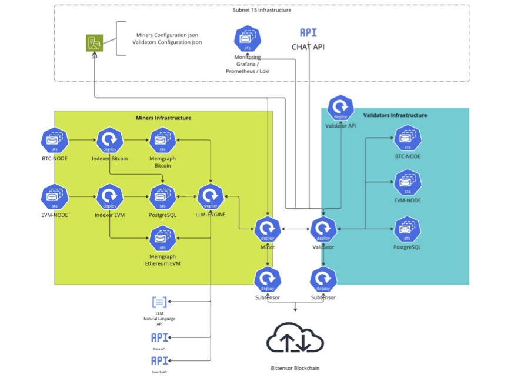

<div align="center">

# **Bittensor Blockchain Insights Subnet**


[](https://discord.gg/mVz5qNRf)
[](https://opensource.org/licenses/MIT)

---

## Blockchain Index Artificial Intelligence

[Blockchain Insights Website](https://www.chain-insights.ai/)

[Join us on Discord](https://discord.gg/mVz5qNRf)

Built with [Bittensor $TAO](https://bittensor.com) • [Documentation](https://docs.bittensor.com/) • [Explore the Subnet](https://taostats.io/subnets/netuid-15/)

</div>

### Table of Contents

- [**Bittensor Blockchain Insights Subnet**](#bittensor-blockchain-insights-subnet)
  - [Blockchain Index Artificial Intelligence](#blockchain-index-artificial-intelligence)
    - [Table of Contents](#table-of-contents)
  - [Overview](#overview)
  - [Problem We Solve](#problem-we-solve)
    - [Increase Adoption by Using Simple Prompts](#increase-adoption-by-using-simple-prompts)
    - [Use Cases](#use-cases)
  - [State of Blockchain Graph Indexes](#state-of-blockchain-graph-indexes)
  - [AI LLM Challenges \& Validation Mechanisms](#ai-llm-challenges--validation-mechanisms)
    - [Bearer Scoring Explained](#bearer-scoring-explained)
      - [Key Aspects of Bearer Scoring:](#key-aspects-of-bearer-scoring)
      - [Implementation in Blockchain Insights Subnet:](#implementation-in-blockchain-insights-subnet)
  - [High-Level Architecture](#high-level-architecture)
    - [System Context](#system-context)
    - [Containers Diagram](#containers-diagram)
  - [Market](#market)
    - [Validator API](#validator-api)
    - [CHAT API](#chat-api)
    - [CHAT UI for Subnet 15](#chat-ui-for-subnet-15)
      - [White Label License](#white-label-license)
  - [Development Roadmap](#development-roadmap)
    - [Milestones:](#milestones)
  - [Installation \& Configuration](#installation--configuration)
    - [Validator \& Miners Installation](#validator--miners-installation)
    - [Miners LLM-ENGINE installation](#miners-llm-engine-installation)
    - [Validators API Installation](#validators-api-installation)
  - [License](#license)

---

## Overview

The Blockchain Insights Subnet is a cutting-edge project dedicated to converting raw blockchain data into structured graph models, offering in-depth insights into blockchain activities such as transactions, DeFi protocol operations, and NFT exchanges.

## Problem We Solve

While companies like [ARKHAM Intelligence](https://www.arkhamintelligence.com/) and specialized investigation agencies such as [Elliptic](https://www.elliptic.co/crypto-blockchain-intelligence) provide proprietary machine learning models for blockchain intelligence, they lack user-friendly interfaces for non-experts. These services are often complex, requiring significant expertise to interpret data.

Though Open Source LLM models like GPT-4o offer advanced language capabilities, they struggle to accurately retrieve and process real-time blockchain data. Tools like [LangChain](https://www.langchain.com/) enable **RAG** (Retrieval Augmented Generation), allowing real-time data retrieval. However, effective use still demands complex prompt engineering and fine-tuning to generate accurate Cypher, GraphQL, SQL, and API queries.

Another challenge is that LLM models can hallucinate, producing plausible but incorrect responses. Without proper context and fine-tuning, the generated queries may fail, particularly when working with specific technologies like Cypher or GraphQL.

Additionally, much of the valuable blockchain data is centralized and developed by closed-source experts, creating barriers to broader adoption and innovation.

### Increase Adoption by Using Simple Prompts

The rapid expansion of blockchain technology and multi-layer networks has introduced complex challenges related to the vast amounts of data generated across different blockchain ecosystems. As decentralized applications, DeFi protocols, and NFTs continue to grow, the need for structured, actionable insights from raw blockchain data becomes critical. Traditional data analysis methods often struggle to keep up with the speed and complexity of blockchain transactions, leading to fragmented and inefficient data processing. This creates significant barriers for developers, researchers, and businesses aiming to extract meaningful insights, optimize their operations, or develop innovative solutions in the blockchain space.

Moreover, the lack of standardized data models and the siloed nature of different blockchain networks further exacerbate these issues. As blockchain ecosystems become increasingly interconnected, a system that can seamlessly integrate data from various sources into a unified, easy-to-analyze format is essential. Without such a solution, stakeholders are left navigating a convoluted landscape of inconsistent data, which hampers their ability to make informed decisions and fully leverage blockchain technology.

### Use Cases

1. **DeFi Analytics**: Understanding the flow of funds across different protocols is crucial for risk assessment, market analysis, and strategic decision-making in decentralized finance (DeFi). The Blockchain Insights Subnet enables comprehensive analysis of DeFi transactions by transforming raw blockchain data into structured graph models, allowing users to visualize asset movements across various DeFi protocols, identify trends, detect anomalies, and optimize strategies.

2. **Smart Contract Analysis**: The explosive growth of NFTs and smart contracts has created a new market with unique dynamics. The Blockchain Insights Subnet facilitates in-depth analysis of NFT and smart contract transactions, enabling users to track ownership changes, evaluate the performance of specific assets or collections, and gain insights into market trends.

3. **Cross-Chain Data Integration**: As more projects embrace multi-chain strategies, the ability to integrate and analyze data from different blockchain networks becomes increasingly important. The Blockchain Insights Subnet supports data integration from various blockchains, including Bitcoin, Ethereum, and Layer 2 solutions like Polygon and Arbitrum. This cross-chain data aggregation enables users to perform holistic analyses, develop cross-chain applications, and enhance interoperability across the blockchain ecosystem.

4. **Compliance and Auditing**: Ensuring compliance with regulatory standards is a significant challenge for businesses operating in the blockchain space. The Blockchain Insights Subnet provides tools for tracking and analyzing transactions across multiple blockchains, simplifying the process of auditing activities, monitoring compliance, and generating reports for regulatory authorities. This capability is essential for maintaining transparency and trust in decentralized systems.

5. **Machine Learning and AI Applications**: The structured data generated by the Blockchain Insights Subnet can be leveraged for advanced machine learning and AI applications. By providing clean, organized datasets, the platform enables the development of predictive models, automated trading strategies, and other AI-driven solutions that operate efficiently within the blockchain environment. This opens up new possibilities for innovation and optimization in the blockchain space.

6. **Transaction Monitoring and Fraud Detection**: In the fast-paced world of cryptocurrency, detecting fraudulent activities and monitoring transactions in real-time is crucial. The Blockchain Insights Subnet can be used to continuously monitor blockchain transactions for signs of fraud, such as unusual patterns, large or suspicious transfers, and attempts to obfuscate the origin of funds. By leveraging advanced graph models and machine learning, businesses can quickly identify and respond to potential threats, helping to prevent financial crimes and enhance security.

8. **Tokenomics Analysis**: For projects that issue their own tokens, understanding the economics of token supply and demand is critical. The Blockchain Insights Subnet can provide detailed insights into token distribution, liquidity, and market movements. This information is vital for project developers, investors, and analysts who need to assess the health and viability of a blockchain project. By analyzing the flow of tokens within the ecosystem, stakeholders can make informed decisions about token management and future developments.


These use cases illustrate the broad applicability of the Blockchain Insights Subnet in addressing data challenges inherent in the blockchain ecosystem, empowering users to unlock the full potential of blockchain technology.

## State of Blockchain Graph Indexes

Some companies specialize in indexing blockchain data, such as [BitQuery](https://bitquery.io/), providing services to experts, exchanges, investigation agencies, and investment firms that can afford these very expensive solutions.

[TheGraph](https://thegraph.com/) token [$GRT](https://www.coingecko.com/en/coins/the-graph), a crypto project with over a billion-dollar market cap, provides a decentralized graph of many blockchains. However, while these are community-driven, critical indexed data for fund flow and advanced algorithm detection—such as PageRank, community detection, anomaly detection, centrality measures, correlation analysis, trend detection, Louvain, Jaccard similarity, shortest path, and others—are often missing.

When comparing [Neo4J](https://neo4j.com/) with [Memgraph](https://memgraph.com/) for graph indexing, Neo4J is the most popular and cost-effective. However, Memgraph, which uses in-memory processing instead of disk storage, improves query speed by 100x, though it requires expensive servers with fast memory. For example, the Bitcoin blockchain currently requires 1.6TB of RAM and EVM use 3.2TB of RAM and continues to grow every day.

Blockchain Insights holds bi-weekly sessions with Memgraph's CTO and engineers to discuss potential improvements, issues, and engineering challenges, as Blockchain Insights uses Memgraph and MAGE with one of the largest known databases, exceeding 1.6TB+.

Use Case: [Amboss Technologies](https://amboss.space/) uses Memgraph Graph Database Servers with live streaming for transaction processing on the [Lightning Network](https://lightning.network/).

Subnet 15 provides templates for indexing Bitcoin and EVM (Ethereum) blockchains. Miners can modify and enhance these templates to improve and add new results.

## AI LLM Challenges & Validation Mechanisms

We provide an LLM-ENGINE module template written in Python using LangChain with engineered prompts designed to work with GPT-4o. This module utilizes [Corcel Subnet 18 API](https://corcel.io/) or [OpenAI API](https://openai.com/).

Miners are challenged to improve the LLM-ENGINE by adding data, refining prompts, and fine-tuning models to respond to user prompts with the most valuable and verifiable data.

Validators use proof-of-inference (zk-ML) to ensure that Miners are using an LLM model to generate prompts and that responses are not altered or tampered with. In addition to proof-of-inference, we also implement **bearer scoring**, which assesses the relevance and accuracy of the data retrieved by the LLM. This scoring mechanism ensures that the responses generated by the LLM are not only accurate but also contextually appropriate, improving the overall quality of the output.

Miners must provide the source of data and queries used to obtain the response so validators can verify the accuracy with a provided API from Subnet 15, which connects to most blockchain and crypto APIs to generate a similarity score. The best similarity score response, validated by both proof-of-inference and bearer scoring, is provided to the end-user.

### Bearer Scoring Explained

**Bearer scoring** is a mechanism used to assess the quality, relevance, and accuracy of the data retrieved or generated by an AI model, particularly in the context of blockchain intelligence and large language models (LLMs). The term "bearer" refers to the entity—usually an LLM or a mining node—that is responsible for producing or providing data in response to a query. The bearer scoring system is designed to evaluate the effectiveness of this data in meeting the specific requirements of the query.

#### Key Aspects of Bearer Scoring:

1. **Relevance**:
   - Bearer scoring evaluates how relevant the data provided by the LLM is to the user's query. It considers whether the information directly addresses the prompt and how well it aligns with the context of the request. High relevance scores are given to responses that closely match the intended output and provide meaningful, contextually appropriate information.

2. **Accuracy**:
   - The accuracy aspect of bearer scoring ensures that the data or response generated by the LLM is factually correct and up-to-date. In the context of blockchain data, this involves verifying the correctness of transactions, the accuracy of balances, and the validity of the blockchain's state as reported by the LLM. The scoring process may involve cross-referencing with external data sources or databases to ensure that the information is precise.

3. **Completeness**:
   - This component of bearer scoring assesses whether the response fully addresses the query without omitting important details. A response that is incomplete or only partially answers the query will receive a lower score, encouraging miners to ensure that their LLM-generated outputs are thorough and comprehensive.

4. **Efficiency**:
   - Efficiency measures how effectively the LLM processes and retrieves the necessary data within an acceptable timeframe. Responses that are generated quickly and with minimal computational overhead, yet still maintain high relevance and accuracy, are rewarded with higher scores. This aspect is particularly important in scenarios where real-time or near-real-time data is required.

5. **Consistency**:
   - Consistency refers to the ability of the LLM to produce similar high-quality responses when queried multiple times under the same or similar conditions. Bearer scoring evaluates whether the LLM can consistently generate reliable data across different sessions, ensuring that users receive dependable outputs over time.

#### Implementation in Blockchain Insights Subnet:

In the Blockchain Insights Subnet, bearer scoring is integrated into the validation process to enhance the reliability and trustworthiness of responses generated by LLMs. Miners are encouraged to optimize their LLM-ENGINEs by focusing on these key aspects, improving the overall performance of the subnet. Validators then use bearer scoring alongside other validation mechanisms, such as proof-of-inference and similarity scoring, to determine the best possible response to deliver to the end-user.

The result is a more robust and user-friendly blockchain intelligence platform that delivers precise, contextually appropriate, and timely insights, even in complex or high-stakes scenarios.

## High-Level Architecture

The high-level architecture of the Blockchain Insights Subnet includes system context and container diagrams.

### System Context

- **Miners:** Transform raw blockchain data into structured graph models, encompassing simple transactions, DeFi protocols, and NFT exchanges, enabling detailed visualizations of monetary movements.
  
- **Protocol:** Defines the rules for data exchange between miners and validators, ensuring consistent and interoperable data formats within the network.

- **Validators:** Route queries between miners, other subnets, and APIs. They also rank miners based on data accuracy and performance, maintaining high standards of data quality.

- **Subnets:** Distinct segments of the Bittensor network, each capable of querying the blockchain insights subnet for specific data and analytics.

- **Users:** Interact with the Blockchain Insights Subnet through interfaces like APIs.

### Containers Diagram



- **Blockchain Node:** Maintains a copy of the blockchain, processes transactions, and participates in consensus mechanisms.

- **Indexers:** Process blockchain data into graph-based models, facilitating complex data analysis within the subnet.

- **Graph Databases - Neo4J or Memgraph with MAGE:** Utilizes Memgraph and MAGE for in-memory graph database operations, supporting Cypher queries and advanced graph algorithms. MAGE's integration with NVIDIA GPUs accelerates graph analytics, enhancing performance for large-scale data analysis.

- **Miner:** Provides data to validators through a predefined protocol, specializing in specific blockchains and graph models to ensure accurate and efficient data handling.

- **LLM-ENGINE**: This Module is the core of the Blockchain intelligence with RAG (Retrieval Augmented Generation) and AI LLM Model engineered prompts that send LLM responses. Miners are challenged to improve, add blockchains, graph, APIs, and databases to answer any user questions (prompts).

- **Subtensor:** Establishes the rules for data exchange between miners and validators, ensuring consistency and effective communication within the Bittensor network.

- **Validator:** Scores, organizes, and ranks miners, ensuring the subnet's data integrity and efficiency, and routing queries appropriately.

- **Validator API:** Provides a gateway for executing user prompts (questions) that LLM transforms into Cypher and SQL queries, supporting both predefined and custom queries for comprehensive data analysis.

- **Datasets:** We provide miners access to organic users prompts with the answers and the similarity score so they can use these to improve their work on the LLM-ENGINE.

- **Chat API:** Provides an API to access the subnet data and develop any application, including Chat UI [Chat-API Documentation](https://chain-insights-ai-chat-api-prod.azurewebsites.net/docs).

- **Chat UI:** Blockchain Insights developed a Chat UI using the Chat API with an augmented experience for displaying complex and interactive graphs, flow of funds, and relationships between nodes to enhance the user experience.

## Market

While the general population that wants to learn more about blockchain or wants to have a detailed explanation of transactions, find anomalies, or use any of the advanced algorithms provided by the system, crypto enthusiasts can use the ChatApp to interact with the LLM to answer any questions they have.

In particular, businesses, regulatory agencies, banks, investment firms, investors, traders, DeFi apps, crypto wallets, blockchain explorers, exchanges, and anyone in the crypto and blockchain industry can use this simple tool to find answers in seconds to any questions.

### Validator API

The API provides all the functionalities of the subnet and is accessible through the Validator API gateway.

### CHAT API

The API is also accessible by Blockchain Insights [Chat-API Documentation](https://chain-insights-ai-chat-api-prod.azurewebsites.net/docs). Contact [Blockchain Insights](https://www.chain-insights.ai/) to obtain an API KEY.

### CHAT UI for Subnet 15

The Blockchain Insight team has developed a Chat UI specialized and enhanced the user experience by providing interactive graphs with augmented details.

A free tier is offered to anyone [Chain Chat AI](https://chat.chain-insights.ai/).

#### White Label License

Validators and resellers can contract Blockchain Insights to get a White Label license for the Web chat UI and provide services to their clients. The Chat UI Web app developed by the team offers better graphics and fund flow diagrams with added information that improves the user experience and includes the latest team developments.

## Development Roadmap

The development of the Blockchain Insights Subnet is organized into four main streams, each with specific objectives and milestones:

- **Subnet**
- **Blockchain Integrations**
- **LLM Intelligence**
- **User Experience**

### Milestones:

Every month we release a major version:

- **Version 1.x**
  - [X] Miners Installation
  - [X] Validators with Synthetic Queries
  - [X] Bitcoin Graph Index on Memgraph

- **Version 2.0**
  - [X] Launch the subnet with support for the Bitcoin blockchain.
  - [X] Develop and integrate the funds flow graph model for Bitcoin data analysis.
  - [X] Cross Validation with Bitcoin Node and Graph Index

- **Version 2.1**
  - [X] Improvement of scoring mechanism
  - [X] PageRank Queries
  
- **Version 2.2 (July 2024)**
  - [X] Improve validator scoring and weighting mechanisms.
    - [X] Benchmarks
    - [X] Uptime
    - [X] Data Integrity check with Cypher Queries
  - [X] Launch a public API for basic queries.
  - [X] Introduce LLM Prompt Engine using Langchain.
  - [X] Bitcoin Balance Indexer on PostgreSQL
  - [X] CHAT UI Beta Release

- **Version 2.3 (August 2024)**
  - [X] Enhance documentation and upgrade infrastructure.
  - [X] LLM-ENGINE Template for Miners AI R&D challenges
  - [X] EVM Indexer Template
  - [X] Validator API to query Miners with LLM Prompts
  - [X] MVP Public Release of [chat.chain-insights.ai](https://chat.chain-insights.ai/) UI
  - [X] MVP Public Release of [Chat APIs](https://chain-insights-ai-chat-api-prod.azurewebsites.net/docs)

- **Version 3.0 (September 2024)**
  - [X] Miners LLM-ENGINE Challenges AI R&D Documentation
  - [ ] Miners INDEXER Challenge R&D Documentation
  - [ ] Add support for EVM (Ethereum) Blockchain Layer 1 and Layer 2.
  - [ ] Expand public API functionalities with advanced algorithms.
  - [ ] Validator Proof-of-Inference (ZK-ML) & Bearer Scoring
  - [ ] Receipt system for query LLM response validation.

- **Version X.X**
  - [X] Live Streaming Template
  

## Installation & Configuration

### [Validator & Miners Installation](https://github.com/blockchain-insights/blockchain-data-subnet-ops)

Since there are many elements required to perform Mining or Validating, we created a repository that contains the installation and operational scripts with Docker Compose containers that are maintained by the Blockchain Insights Subnet 15 DevOps team. Visit the [Blockchain Data Subnet Ops](https://github.com/blockchain-insights/blockchain-data-subnet-ops) repository.

**These include scripts with the already created Docker Compose YAML with required dependencies and environment variables:**
- Docker Compose installation instructions
- Bitcoin Node
- Memgraph Graph Database Server
- Indexers (Bitcoin and EVM)
- Subtensor Node (Bittensor)
- Miners/Validator scripts for communicating with the Bittensor blockchain.
- LLM-ENGINE

### [Miners LLM-ENGINE installation](https://github.com/blockchain-insights/blockchain-data-subnet-llm-engine)

The [Blockchain LLM-ENGINE](https://github.com/blockchain-insights/blockchain-data-subnet-llm-engine) repository contains the basic template of the LLM-ENGINE that miners will use to send users queries (prompts). Miners can improve this engine by conducting Research & Development (R&D) to enhance the AI LLM's ability to respond accurately to user prompts.

### [Validators API Installation](https://github.com/blockchain-insights/blockchain-data-subnet-validator-api)

The [Blockchain Validator API](https://github.com/blockchain-insights/blockchain-data-subnet-validator-api) repository contains the API for validators to provide access to users for the subnet's functionalities and resources. This module can be used and modified by validators to offer access to the subnet's capabilities.

## License

This repository is licensed under the MIT License.

```text
The MIT License (MIT)
© 2023 Yuma Rao

Permission is hereby granted, free of charge, to any person obtaining a copy of this software and associated documentation files (the “Software”), to deal in the Software without restriction, including without limitation the rights to use, copy, modify, merge, publish, distribute, sublicense, and/or sell copies of the Software, and to permit persons to whom the Software is furnished to do so, subject to the following conditions:

The above copyright notice and this permission notice shall be included in all copies or substantial portions of the Software.

THE SOFTWARE IS PROVIDED “AS IS”, WITHOUT WARRANTY OF ANY KIND, EXPRESS OR IMPLIED, INCLUDING BUT NOT LIMITED TO THE WARRANTIES OF MERCHANTABILITY, FITNESS FOR A PARTICULAR PURPOSE AND NONINFRINGEMENT. IN NO EVENT SHALL THE AUTHORS OR COPYRIGHT HOLDERS BE LIABLE FOR ANY CLAIM, DAMAGES OR OTHER LIABILITY, WHETHER IN AN ACTION OF CONTRACT, TORT OR OTHERWISE, ARISING FROM, OUT OF OR IN CONNECTION WITH THE SOFTWARE OR THE USE OR OTHER DEALINGS IN THE SOFTWARE.  